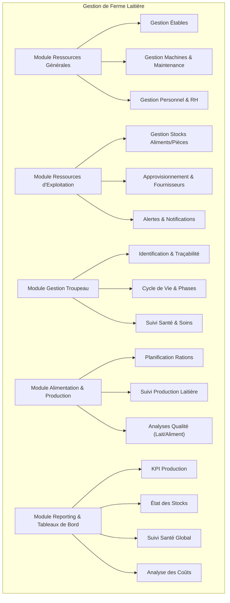
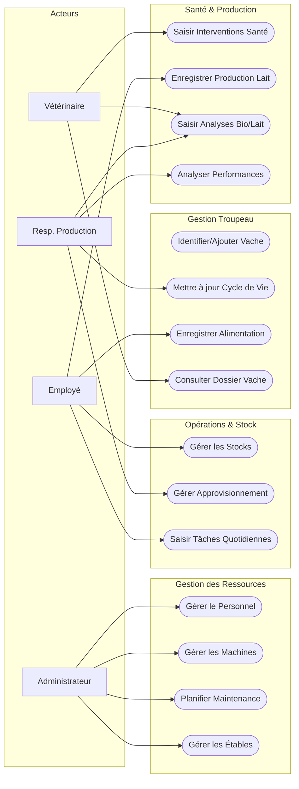
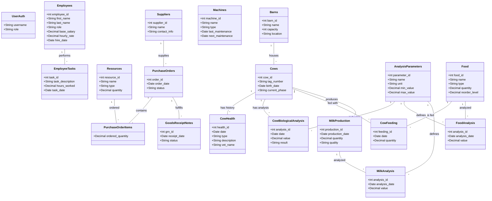

# Conception Fonctionnelle - Gestion de Ferme Laitière

Ce document présente la conception fonctionnelle de l'application de gestion d'une ferme de production laitière, basée sur les modèles de données actuels et les spécifications fournies.

## 1. Acteurs

| Acteur | Rôle et Responsabilités |
| :--- | :--- |
| **Administrateur** | Gestion globale du système, configuration, gestion des utilisateurs et des droits, supervision des ressources humaines et matérielles. |
| **Employé / Ouvrier** | Exécution des tâches quotidiennes, saisie des données opérationnelles (alimentation, production, mouvements de stock), réception des notifications. |
| **Vétérinaire** | Suivi de la santé du troupeau, saisie des interventions médicales, consultation et saisie des analyses biologiques. |
| **Responsable de Production** | Analyse des performances de production, contrôle de la qualité (lait, alimentation), prise de décision stratégique. |
| **Système (Automatique)** | Surveillance des seuils (stocks, maintenance), génération d'alertes et notifications. |

## 2. Architecture Fonctionnelle

L'application est structurée en modules interconnectés couvrant l'ensemble des activités de la ferme.

## 3. Diagramme des Cas d'Utilisation (Use Cases)

Ce diagramme illustre les interactions des différents acteurs avec les fonctionnalités principales du système.

## 4. Diagramme de Classes (Modèle de Données)

Ce diagramme reflète la structure actuelle de la base de données (basé sur `models.py`), montrant les entités et leurs relations.

## 5. Scénarios d'Utilisation (Détails)

### Gestion du Stock d'Aliments
1.  **Acteur** : Employé.
2.  **Action** : Enregistre une sortie de stock (ex: 500kg de Maïs) pour l'alimentation.
3.  **Système** :
    *   Met à jour la quantité dans `Food`.
    *   Vérifie si `Quantity` < `ReorderLevel`.
    *   Si Oui : Crée une **Notification** (ou Alerte) pour le Responsable.

### Suivi de Cycle de Vie d'une Vache
1.  **Acteur** : Vétérinaire ou Responsable.
2.  **Action** : Déclare le vêlage d'une vache.
3.  **Système** :
    *   Met à jour `Cows.current_phase` de "Gestation" à "Lactation".
    *   Crée une nouvelle entrée `Cows` pour le veau (lien mère-enfant possible si modèle étendu).
    *   Active le suivi de `MilkProduction` pour la mère.

### Planification Maintenance
1.  **Acteur** : Administrateur.
2.  **Action** : Consulte la liste des `Machines`.
3.  **Système** : Affiche les machines dont `NextMaintenance` est proche.
4.  **Action** : Planifie une intervention.
5.  **Système** : Met à jour `NextMaintenance`.

### Production Laitière et Qualité
1.  **Acteur** : Employé (Traite) / Resp. Production (Analyse).
2.  **Action** : Enregistre la traite du jour (`MilkProduction`).
3.  **Action** : Enregistre les résultats d'analyse (`MilkAnalysis`) pour cet échantillon.
4.  **Système** : Associe les données. Si qualité insuffisante (ex: taux protéique bas), alerte le nutritionniste pour ajuster la ration (`CowFeeding`).
